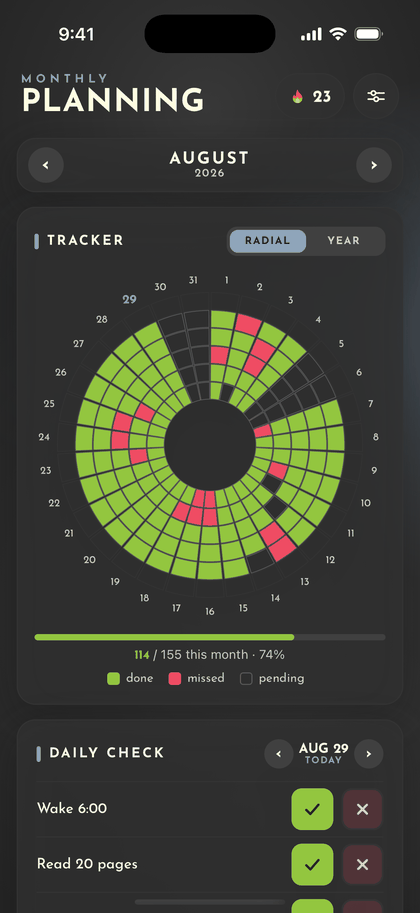
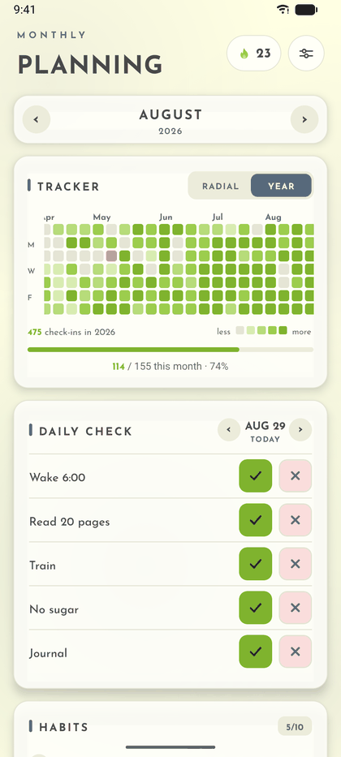
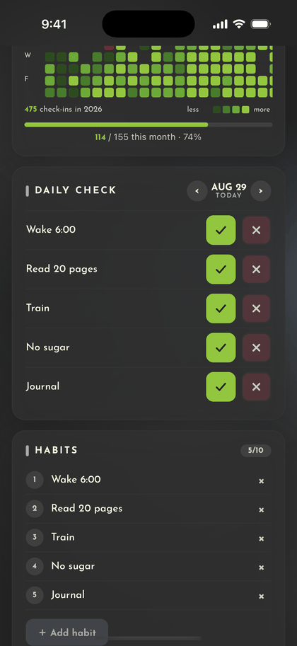
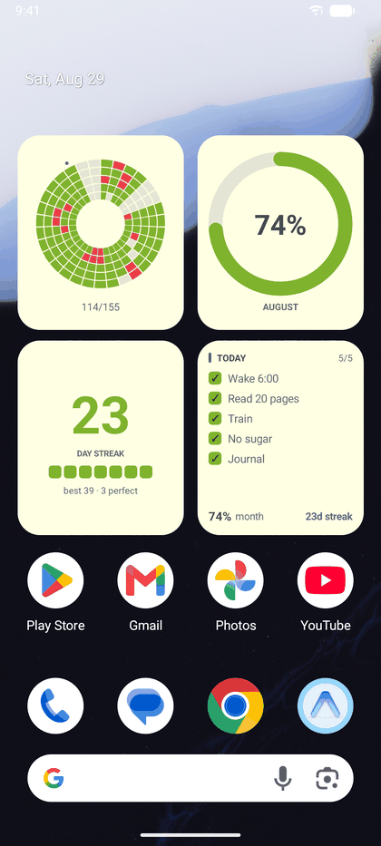

# Monthly Planning

A digital version of the whiteboard "Monthly Planning" board with a **radial habit tracker** — built with Expo / React Native for iOS and Android.

| Planner | Year grid | Daily check | Widgets |
| :-: | :-: | :-: | :-: |
|  |  |  |  |
| iOS · dark | Android · light | iOS · dark | Android · light |

Sample data, not a real month. The full set of widget layouts for both
platforms is in [`screenshot-widgets/`](screenshot-widgets/).

## Open, and staying that way

I built this for myself, and then put it somewhere anyone could take it.

**Nothing you write here leaves your phone.** No analytics, no trackers, no
crash reporters, no ad SDKs — the dependency list is short enough to read in a
minute, and you are welcome to. Your habits, notes and goals live in local
storage on the device and nowhere else. An account is optional and exists only
so your history can follow you to a new phone; the app is fully usable without
ever creating one.

**The source stays public for as long as this app exists.** That is a promise
about the licence, not just the current state of the repo — see [LICENSE](LICENSE).

**If something here annoys you, change it.** Fork it, strip out the parts you
don't want, build the version you would rather use. That is the entire point of
it being open. You don't need permission and you don't need to ask.

Credit is entirely optional and I would never dream of asking. It's just that
"Owais Khan" fits very comfortably in a footer, costs you one line, and I will
be refreshing the forks page regardless, serene, unbothered, definitely not
counting.

## Features

- **Radial habit tracker** — the circle is divided into one sector per day of the month and one ring per habit (innermost ring = habit 1). Tap a cell to cycle: pending → **done** (green) → **missed** (red) → pending. Today's date is highlighted.
- **Yearly grid** — switch the tracker to a GitHub-style contribution graph of the whole year. Cell intensity reflects how many habits you completed that day; tap any cell to jump to that month and day. Auto-scrolls to the open month.
- **Daily check** — a per-day checklist with ✓ / ✗ buttons, so filling the chart is one tap per habit. Navigate days with the arrows; today is badged.
- **Habits** — add, rename, and remove up to 10 habits per month. Removing a habit with marks asks for confirmation.
- **Deadlines** — tasks with a date and time on them, below the daily check. Each row shows how long is left, and a bar that fills over the final week, so the pressure is visible between the colour bands as well as through them. Reminders escalate as the date approaches: three days out, one day, three hours, one hour, and at the deadline itself, with one nag the morning after a missed one. They live on their own Android notification channel, so the daily habit nudges can be muted without losing them. Ticking one off files it away: the section lists only what is still outstanding, with a count of the finished ones and a link straight through to history. The widgets and the reminders ignore finished tasks too — a deadline you have met is not a deadline any more.
- **History** — a read-only log of what actually happened, newest first: which habits were ticked or missed each day, and which deadlines were finished on time or late. Filter by habits or deadlines, and page further back six months at a time. Derived from the months and tasks already stored, so there is no second copy to fall out of step.
- **Observations** — free-form note lines, add/remove as needed.
- **Key Goals** — three goal boxes with a "mark done" toggle.
- **Discipline quote** — rotates daily.
- **Dark mode** — on by default, switched in Settings. The choice persists, and the home-screen widgets follow it.
- **Widgets** — eight of them on both platforms (radial, year, streak, today, goals, progress, daily quote, deadlines), plus Lock Screen accessories on iOS.
- **Reminders** — a few nudges a day, only while something is still unmarked, and a note when the day is done. Habit nudges and deadline reminders are rewritten together, within a budget, because iOS keeps only the 64 soonest pending local notifications.
- **Account** — optional, and only for carrying history to a new phone.
- **Month navigation** — every month keeps its own habits, grid, observations, and goals, persisted on-device with AsyncStorage.

## Run it

```bash
npm install
npx expo start
```

- **On your phone**: install the Expo Go app (App Store / Play Store) and scan the QR code printed in the terminal.
- **Android emulator**: `npx expo start --android`
- **iOS simulator** (needs Xcode): `npx expo start --ios`

## Ship it

To produce store-ready binaries, use [EAS Build](https://docs.expo.dev/build/setup/):

```bash
npx eas build --platform all
```

## Structure

```
App.tsx                        root: persisted settings, account, font, theme provider

src/theme.ts                   palettes, type scale, radii — the only place colour is defined
src/types.ts                   data model (MonthData, Habit, cell states)
src/storage.ts                 AsyncStorage load/save per month + year summary
src/tasks.ts                   deadlines — kept outside MonthData, since a date isn't a month
src/deadlines.ts               how close a deadline is, and how that should read
src/history.ts                 the day-by-day log, derived from months and tasks
src/streaks.ts                 how consecutive days are counted
src/auth.ts                    local account record (no password is ever stored)
src/session.ts                 auth tokens, in Keychain / Keystore — not AsyncStorage
src/onboarding.ts              whether the intro has been shown
src/quotes.ts                  discipline quotes, one per day
src/notifications.ts           reminder schedule

src/navigation/ScreenLayer     how a layer slides, recedes and swipes back
src/navigation/Navigator       which screens exist and what sits under what

src/screens/IntroScreen        four-page first run
src/screens/AuthScreen         sign in / create account
src/screens/ForgotPasswordScreen
src/screens/SettingsScreen     account + appearance
src/screens/HistoryScreen      the log, read-only
src/screens/PlannerScreen      the planner, layout and gestures only
src/screens/plannerStyles      its stylesheet

src/hooks/useMonthData         the open month and every way it changes
src/hooks/useYearSummary       year load + live tally overlay
src/hooks/useCurrentStreak     the header flame
src/hooks/useTasks             the deadline list and every way it changes
src/hooks/useHistory           the history window, and paging further back
src/hooks/useNow               a coarse clock, for the things that age on their own
src/hooks/useOutboundSync      pushes to widgets and reminders

src/components/                RadialTracker, YearChart, DailyCheck, HabitsList,
                               Observations, KeyGoals, Deadlines, DueDatePicker,
                               StreakBadge, MarkButton, SegmentedControl,
                               AuroraBackground, …

src/widgets/                   snapshot written to the shared container
targets/widgets/               iOS WidgetKit (SwiftUI)
targets/android-widgets/       Android home screen (Jetpack Glance)
plugins/                       Expo config plugin for the Android widgets
```
